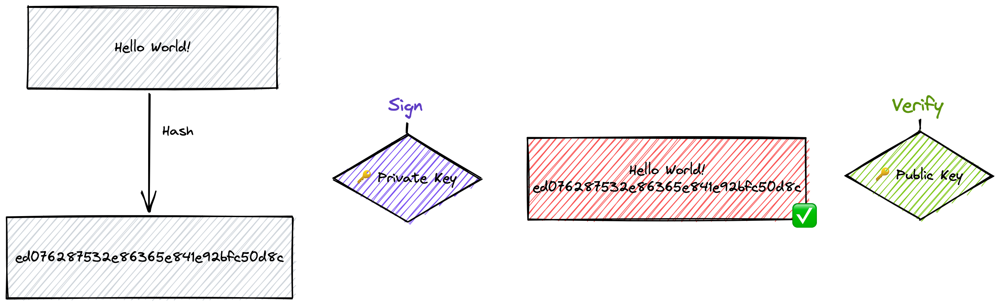

<h1 align="center">🔐 Cryptography Concepts 🔐</h1>

## Cryptography concepts 🔐

- [**Hash**](#hash)
- [**Salt**](#salt)
- [**HMAC**](#hmac)
- [**Symmetric Encryption**](#symmetric-encryption)
- [**Asymmetric Encryption**](#asymmetric-encryption)
- [**Sign**](#sign)

<div id="hash">
    <h2>Hash</h2>
    <div align="center">
        
    </div>
    
### Test the `hash` cryptography concept

In order to do so, execute the following command on your terminal:
```bash
node hash.js
```
    
</div>

<div id="salt">
    <h2>Salt</h2>
    <div align="center">
        
    </div>

### Test the `salt` cryptography concept

In order to do so, execute the following command on your terminal:
```bash
node salt.js
```

</div>

<div id="hmac">
    <h2>HMAC</h2>
    <div align="center">
        
    </div>

### Test the `hmac` cryptography concept

In order to do so, execute the following command on your terminal:

```bash
node hmac.js
```

</div>

<div id="symmetric-encryption">
    <h2>Symmetric Encryption</h2>
    <div align="center">
        
    </div>

### Test the `symmetric encryption` cryptography concept

In order to do so, execute the following command on your terminal:

```bash
node symmetric-encrypt.js
```


</div>

<div id="asymmetric-encryption">
    <h2>Asymmetric Encryption</h2>
    <div align="center">
        
    </div>

### Test the `asymmetric encryption` cryptography concept

In order to do so, execute the following command on your terminal:

```bash
node asymmetric-encrypt.js
```

</div>

<div id="sign">
    <h2>Sign</h2>
    <div align="center">
        
    </div>

### Test the `sign` cryptography concept

In order to do so, execute the following command on your terminal:

```bash
node sign.js
```

</div>
